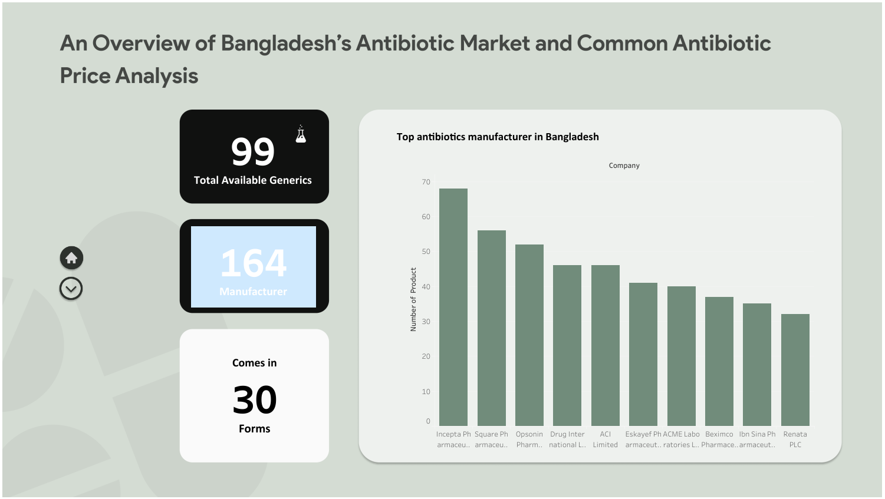
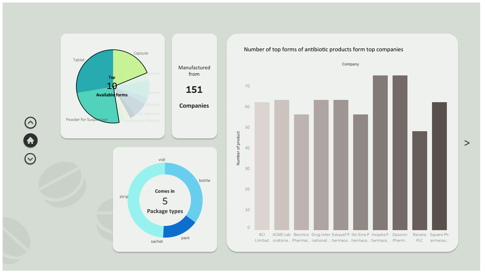
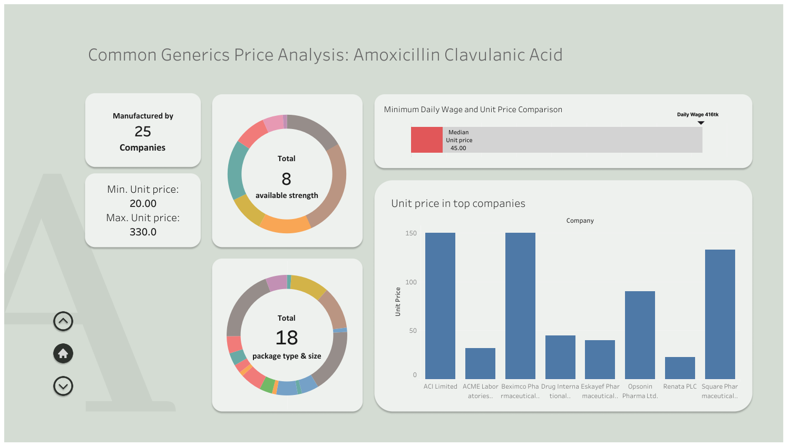
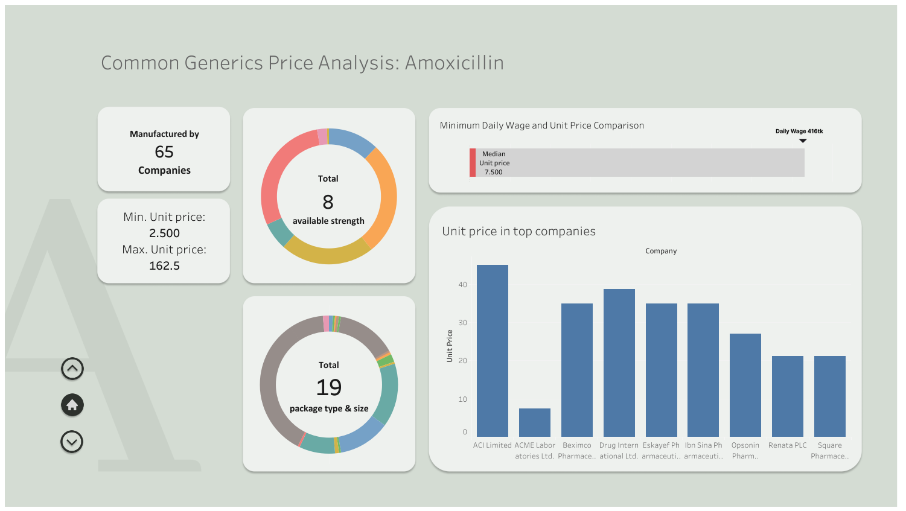
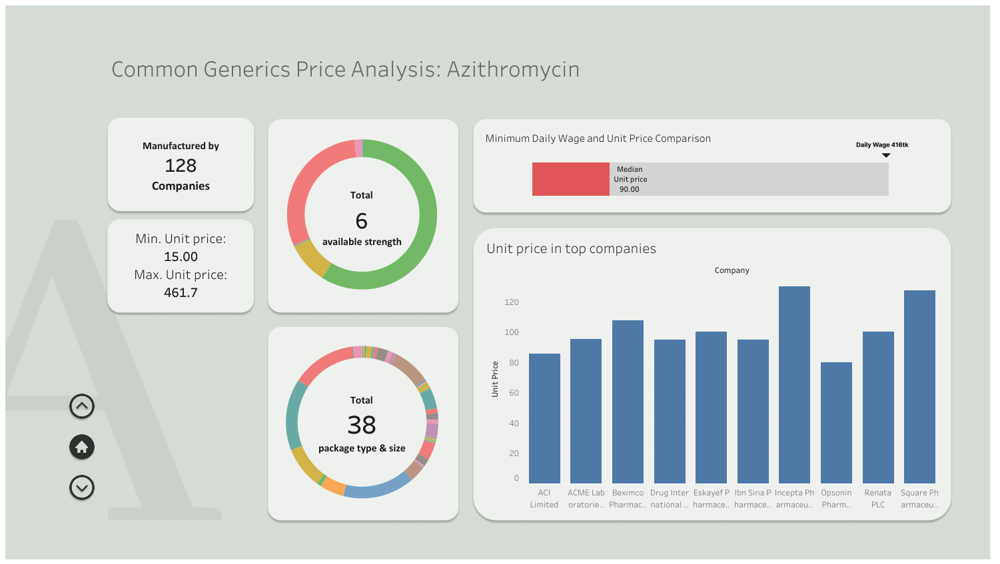
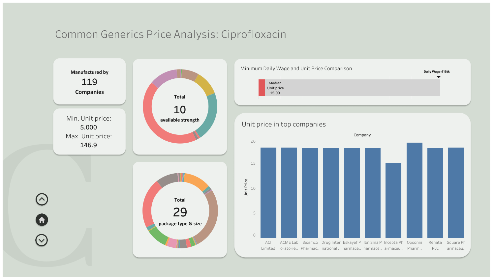
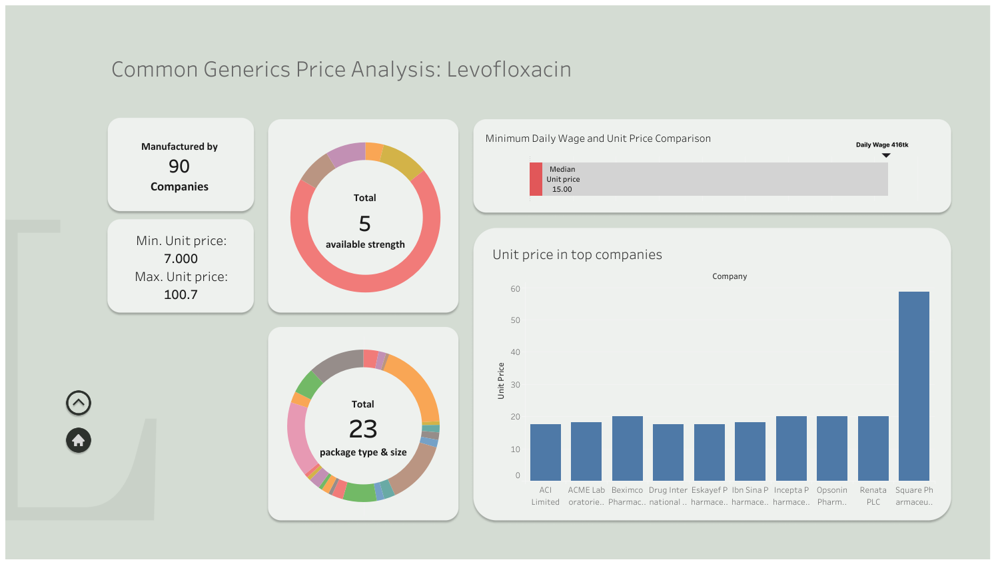

<a target="_blank" href="https://colab.research.google.com/github/HasnatHridoy/BD-antibiotic-drug-market-analysis/blob/main/scraper_files/notebooks/antibiotics_data_scraping.ipynb">
  
</a>

## Problem Statement
Bangladesh's drug market is huge, and antibiotic drugs make up a significant portion of it. In this project, we will provide an overview of the current antibiotics market in Bangladesh. We will also explore the prices of some commonly prescribed antibiotics across several top brands.

We would like to thank <a href="https://medex.com.bd/">MedEx</a>, from which we have extracted data for 3,700 antibiotic products for this analysis.

## The Goals
In this analysis, we will focus on the following points:

1. Identifying the most widely produced antibiotic generics in Bangladesh.  
2. Highlighting the top antibiotic manufacturers in Bangladesh.  
3. Examining company specializations in various dosage forms.  
4. Analyzing the strength, packaging, and pricing of commonly prescribed antibiotics.  
5. Comparing the unit prices of commonly available antibiotics across top brands.  
6. Comparing the daily minimum wage with the per-unit prices of common antibiotics in different strengths.

## Key Findings from the <a href="https://public.tableau.com/views/AnOverviewofBangladeshsAntibioticMarketandCommonAntibioticPriceAnalysis_/Dashboard1?:language=en-GB&:sid=&:redirect=auth&:display_count=n&:origin=viz_share_link">Dashboard </a>




- From the data, we found that *99 generics of antibiotics* are available in Bangladesh, manufactured by *164 companies*, and offered in *30 dosage forms* (tablet, powder for suspension, capsule, etc.).  
- *Incepta Pharmaceuticals Ltd.* manufactures the highest number of antibiotic products in Bangladesh and also covers the widest range of generics.  
- *Azithromycin* is the most widely produced antibiotic generic in Bangladesh.  



- The top three dosage forms are *tablets, powder for suspension, and capsules*.  
- *Opsonin* and *Incepta* hold the top position in manufacturing these top 3 forms of antibiotics.  
- *Incepta* is also the leader in producing IV and IM injections, as well as infusion products.  
- The *ophthalmic antibiotics* market is relatively less saturated.  








- Common antibiotics are available in various doses and forms.
- Most antibiotic doses are priced below the minimum daily wage in Bangladesh.

## Reproduction of the project

### For Colab users

Go to Colab vai below link and click run all.

<a target="_blank" href="https://colab.research.google.com/github/HasnatHridoy/BD-antibiotic-drug-market-analysis/blob/main/scraper_files/notebooks/antibiotics_data_scraping.ipynb">
  
</a>


### For Running locally

1. Clone the repository and navigate to the scripts folder:

```bash
git clone https://github.com/HasnatHridoy/BD-antibiotic-drug-market-analysis.git
cd BD-antibiotic-drug-market-analysis/scraper_files/scripts
```

2. Install dependencies:

```bash
pip install -r requirements.txt
```

3. Download & Install ChromeDriver (if not already installed):

Check your Chrome version: Open Chrome → Settings → About Chrome
Download the matching version from ChromeDriver Downloads
Extract and either place in a folder in your system PATH or leave it for webdriver-manager to handle automatically

```bash
chromedriver --version
```

4. Run the scraper script:

```bash
python local_scraper.py
```

Note: If ChromeDriver is in PATH, it uses that
Otherwise, webdriver-manager downloads the correct version automatically

### Dataset

You can find the dataset from <a href="https://github.com/HasnatHridoy/BD-antibiotic-drug-market-analysis/blob/main/scraped_data/data_extracted.csv"> here </a>


