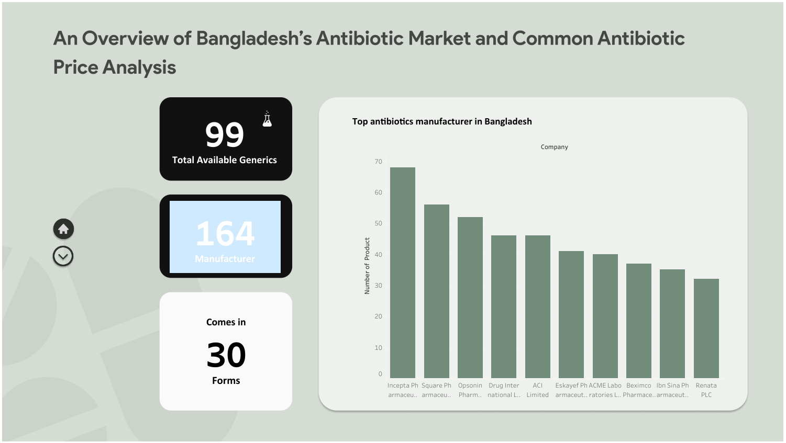
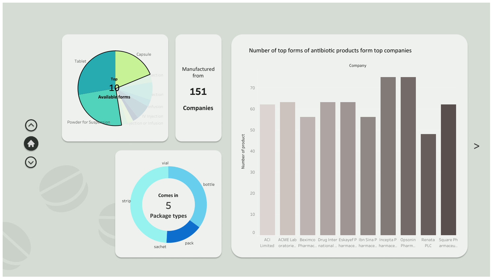
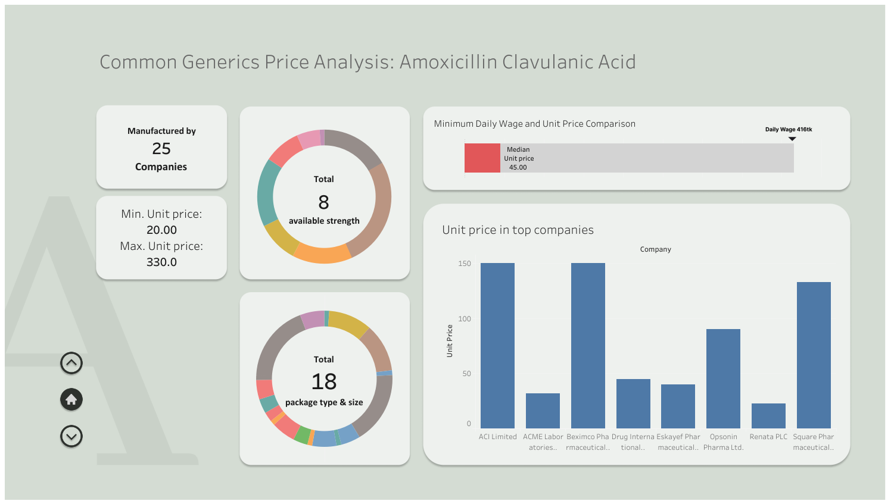
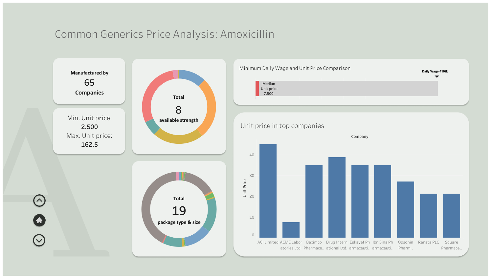
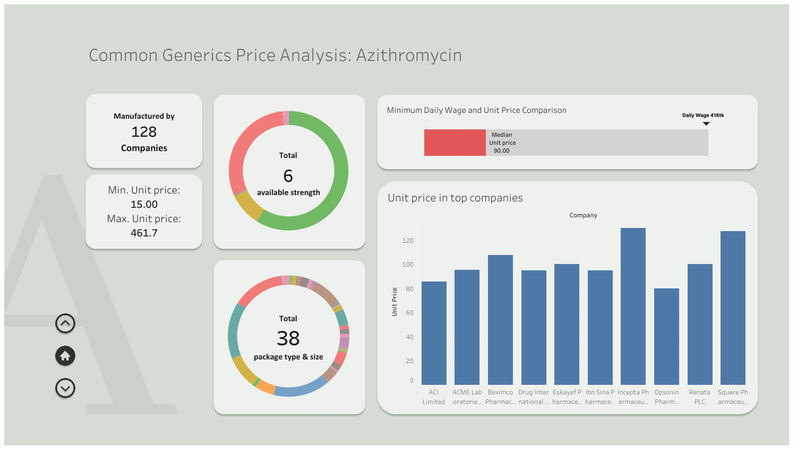
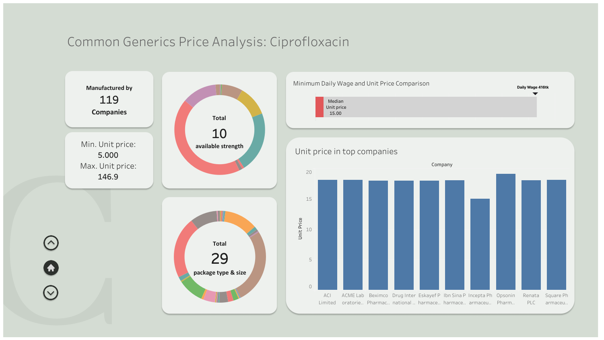
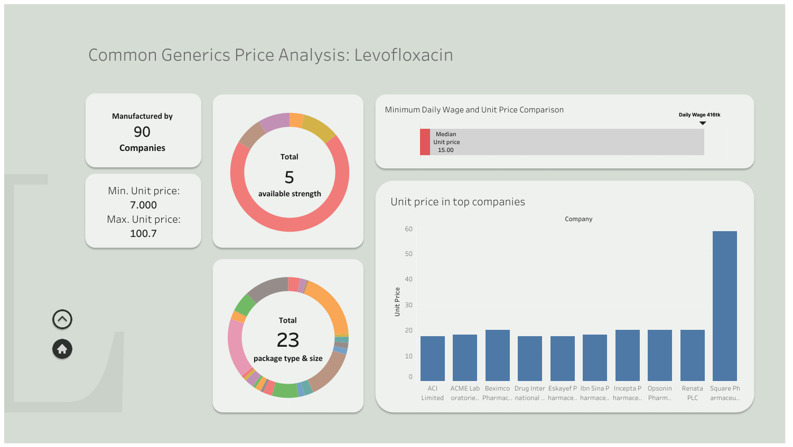

## Problem Statement
Bangladesh's drug market is huge, and antibiotic drugs make up a significant portion of it. In this project, we will provide an overview of the current antibiotics market in Bangladesh. We will also explore the prices of some commonly prescribed antibiotics across several top brands.

We would like to thank <a href="https://medex.com.bd/">MedEx</a>, from which we have extracted data for 3,651 antibiotic products for this analysis.

## The Goals
In this analysis, we will focus on the following points:

1. Identifying the most widely produced antibiotic generics in Bangladesh.  
2. Highlighting the top antibiotic manufacturers in Bangladesh.  
3. Examining company specializations in various dosage forms.  
4. Analyzing the strength, packaging, and pricing of commonly prescribed antibiotics.  
5. Comparing the unit prices of commonly available antibiotics across top brands.  
6. Comparing the daily minimum wage with the per-unit prices of common antibiotics in different strengths.

## Key Findings from the <a href="https://public.tableau.com/views/AnOverviewofBangladeshsAntibioticMarketandCommonAntibioticPriceAnalysis_/Dashboard1?:language=en-GB&:sid=&:redirect=auth&:display_count=n&:origin=viz_share_link">Dashboard </a>

- From the data, we found that *99 generics of antibiotics* are available in Bangladesh, manufactured by *164 companies*, and offered in *30 dosage forms* (tablet, powder for suspension, capsule, etc.).  
- *Incepta Pharmaceuticals Ltd.* manufactures the highest number of antibiotic products in Bangladesh and also covers the widest range of generics.  
- *Azithromycin* is the most widely produced antibiotic generic in Bangladesh.  

- The top three dosage forms are *tablets, powder for suspension, and capsules*.  
- *Opsonin* and *Incepta* hold the top position in manufacturing these top 3 forms of antibiotics.  
- *Incepta* is also the leader in producing IV and IM injections, as well as infusion products.  
- The *ophthalmic antibiotics* market is relatively less saturated.  

- Common antibiotics are available in various doses and forms.
- Most antibiotic doses are priced below the minimum daily wage in Bangladesh.

## Reproduction of this project

### For Colab users

Go to Colab via below link and click run all.

### For local users

#### Chromedriver setup

- Go to the  <a href='https://googlechromelabs.github.io/chrome-for-testing/'>Google Chrome Labs </a> and download the stable version of the chrome driver.
- Unzip it and run the chromedriver.exe
- Copy the chromedriver to your C:\Windows (for Windows)

#### Creating a venv

- Open VS-Code and an empty folder to serve as your project directory.
- On your terminal use this command:  `python -m venv .venv`
- The run this command:  `.venv/Scripts/Activate` (for Windows)

#### Running the scraper

- Clone the repository using the following command: 
  `git clone https://github.com/HasnatHridoy/BD-antibiotic-drug-market-analysis.git`
- Navigate into the folder after cloning: 
  `cd BD-antibiotic-drug-market-analysis`
- Install the required libraries and dependencies: 
  `pip install -r requirements.txt`
- Run the main script to extract the data; the output will be a file named `data_extracted.csv`: 
  `python scraper_files/scripts/main.py`

### Dataset

You can find the dataset from <a href="https://github.com/HasnatHridoy/BD-antibiotic-drug-market-analysis/blob/main/scraped_data/data_extracted.csv"> here </a>

